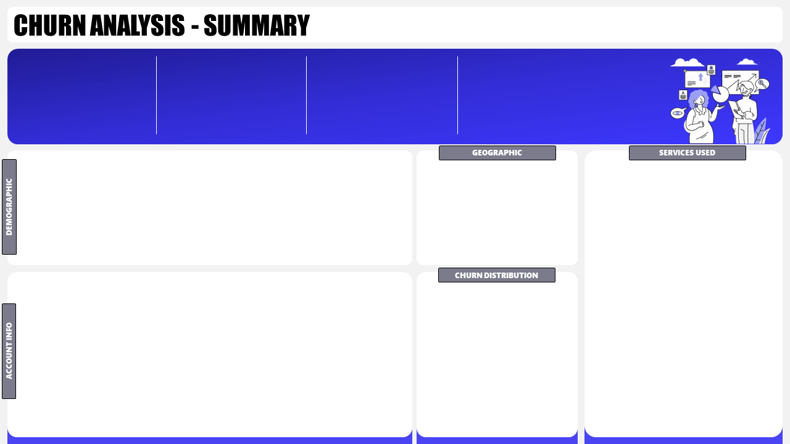

# 📊 Telecom Customer Churn Analysis


> An end-to-end customer churn analysis project for a telecom company — covering SQL-based ETL, Power BI dashboards, and a churn prediction page.

---

## 🖼️ Dashboard Preview



---

## 📈 Key Numbers at a Glance

| Metric | Value |
|---|---|
| 👥 Total Customers | **6K** |
| 🆕 New Joiners | **411** |
| 📉 Total Churn | **2K** |
| 🚨 Churn Rate | **27.0%** |

---

## 🎯 Project Goals

- 📌 Visualize and analyze customer data across **Demographic**, **Geographic**, **Payment & Account**, and **Services** dimensions
- 🔍 Study churner profiles to identify areas for targeted **marketing campaigns**
- 🤖 Identify a method to **predict future churners**

---

## 🗂️ Repository Structure

```
📦 Telecom-Churn-Analysis/
│
├── 📁 data/
│   └── Customer_Data.csv              # Raw source data (6,418 records)
│
├── 📁 sql/
│   ├── 01_create_database.sql         # Create db_Churn database
│   ├── 02_data_exploration.sql        # Null checks & distinct value queries
│   └── 03_etl_and_views.sql           # Clean data load + Power BI views
│
├── 📁 powerbi/
│   ├── churn_analysis.pbix            # Power BI dashboard file
│   └── power_query_and_measures.md   # All Power Query steps & DAX measures
│
├── 📁 assets/
│   ├── backgrounds/                   # Dashboard background images
│   └── icons/                         # Icons used in the report
│
├── .gitignore
└── README.md
```

---

## 🛠️ Tech Stack

| Tool | Purpose |
|---|---|
| **Microsoft SQL Server** | ETL, data cleaning, staging & production tables |
| **SSMS** | SQL query interface |
| **Power BI Desktop** | Dashboard & visualizations |
| **Power Query (M)** | Data transformation inside Power BI |
| **DAX** | Measures and KPI calculations |

---

## 🚀 How to Run This Project

### ✅ Step 1 — Set Up SQL Server

1. Install [SQL Server](https://www.microsoft.com/en-us/sql-server/sql-server-downloads) and [SSMS](https://learn.microsoft.com/en-us/sql/ssms/download-sql-server-management-studio-ssms)
2. Run `sql/01_create_database.sql` to create the `db_Churn` database
3. Import `data/Customer_Data.csv` as staging table `stg_Churn` via SSMS Import Wizard:
   - Right-click `db_Churn` → **Tasks → Import → Flat File** → Browse CSV
   - Set `Customer_ID` as **Primary Key**
   - Allow **NULLs** for all other columns
   - Change any `Bit` type columns to `Varchar(50)`
4. Run `sql/02_data_exploration.sql` to explore and validate the data
5. Run `sql/03_etl_and_views.sql` to clean data and create the `prod_Churn` table + views

### ✅ Step 2 — Open in Power BI

1. Open `powerbi/churn_analysis.pbix` in **Power BI Desktop**
2. Update the data source to point to your SQL Server instance
3. Click **Refresh**

---

## 🗄️ SQL Queries

### 1️⃣ Create Database

```sql
CREATE DATABASE db_Churn;
```

---

### 2️⃣ Data Exploration — Check Distinct Values

```sql
-- Gender Distribution
SELECT Gender, Count(Gender) as TotalCount,
Count(Gender) * 1.0 / (Select Count(*) from stg_Churn) as Percentage
FROM stg_Churn
GROUP BY Gender;

-- Contract Distribution
SELECT Contract, Count(Contract) as TotalCount,
Count(Contract) * 1.0 / (Select Count(*) from stg_Churn) as Percentage
FROM stg_Churn
GROUP BY Contract;

-- Customer Status & Revenue
SELECT Customer_Status, Count(Customer_Status) as TotalCount, Sum(Total_Revenue) as TotalRev,
Sum(Total_Revenue) / (Select sum(Total_Revenue) from stg_Churn) * 100 as RevPercentage
FROM stg_Churn
GROUP BY Customer_Status;

-- State Distribution
SELECT State, Count(State) as TotalCount,
Count(State) * 1.0 / (Select Count(*) from stg_Churn) as Percentage
FROM stg_Churn
GROUP BY State
ORDER BY Percentage DESC;
```

---

### 3️⃣ Data Exploration — Check Nulls

```sql
SELECT 
    SUM(CASE WHEN Customer_ID IS NULL THEN 1 ELSE 0 END) AS Customer_ID_Null_Count,
    SUM(CASE WHEN Gender IS NULL THEN 1 ELSE 0 END) AS Gender_Null_Count,
    SUM(CASE WHEN Age IS NULL THEN 1 ELSE 0 END) AS Age_Null_Count,
    SUM(CASE WHEN Married IS NULL THEN 1 ELSE 0 END) AS Married_Null_Count,
    SUM(CASE WHEN State IS NULL THEN 1 ELSE 0 END) AS State_Null_Count,
    SUM(CASE WHEN Number_of_Referrals IS NULL THEN 1 ELSE 0 END) AS Number_of_Referrals_Null_Count,
    SUM(CASE WHEN Tenure_in_Months IS NULL THEN 1 ELSE 0 END) AS Tenure_in_Months_Null_Count,
    SUM(CASE WHEN Value_Deal IS NULL THEN 1 ELSE 0 END) AS Value_Deal_Null_Count,
    SUM(CASE WHEN Phone_Service IS NULL THEN 1 ELSE 0 END) AS Phone_Service_Null_Count,
    SUM(CASE WHEN Multiple_Lines IS NULL THEN 1 ELSE 0 END) AS Multiple_Lines_Null_Count,
    SUM(CASE WHEN Internet_Service IS NULL THEN 1 ELSE 0 END) AS Internet_Service_Null_Count,
    SUM(CASE WHEN Internet_Type IS NULL THEN 1 ELSE 0 END) AS Internet_Type_Null_Count,
    SUM(CASE WHEN Online_Security IS NULL THEN 1 ELSE 0 END) AS Online_Security_Null_Count,
    SUM(CASE WHEN Online_Backup IS NULL THEN 1 ELSE 0 END) AS Online_Backup_Null_Count,
    SUM(CASE WHEN Device_Protection_Plan IS NULL THEN 1 ELSE 0 END) AS Device_Protection_Plan_Null_Count,
    SUM(CASE WHEN Premium_Support IS NULL THEN 1 ELSE 0 END) AS Premium_Support_Null_Count,
    SUM(CASE WHEN Streaming_TV IS NULL THEN 1 ELSE 0 END) AS Streaming_TV_Null_Count,
    SUM(CASE WHEN Streaming_Movies IS NULL THEN 1 ELSE 0 END) AS Streaming_Movies_Null_Count,
    SUM(CASE WHEN Streaming_Music IS NULL THEN 1 ELSE 0 END) AS Streaming_Music_Null_Count,
    SUM(CASE WHEN Unlimited_Data IS NULL THEN 1 ELSE 0 END) AS Unlimited_Data_Null_Count,
    SUM(CASE WHEN Contract IS NULL THEN 1 ELSE 0 END) AS Contract_Null_Count,
    SUM(CASE WHEN Paperless_Billing IS NULL THEN 1 ELSE 0 END) AS Paperless_Billing_Null_Count,
    SUM(CASE WHEN Payment_Method IS NULL THEN 1 ELSE 0 END) AS Payment_Method_Null_Count,
    SUM(CASE WHEN Monthly_Charge IS NULL THEN 1 ELSE 0 END) AS Monthly_Charge_Null_Count,
    SUM(CASE WHEN Total_Charges IS NULL THEN 1 ELSE 0 END) AS Total_Charges_Null_Count,
    SUM(CASE WHEN Total_Refunds IS NULL THEN 1 ELSE 0 END) AS Total_Refunds_Null_Count,
    SUM(CASE WHEN Total_Extra_Data_Charges IS NULL THEN 1 ELSE 0 END) AS Total_Extra_Data_Charges_Null_Count,
    SUM(CASE WHEN Total_Long_Distance_Charges IS NULL THEN 1 ELSE 0 END) AS Total_Long_Distance_Charges_Null_Count,
    SUM(CASE WHEN Total_Revenue IS NULL THEN 1 ELSE 0 END) AS Total_Revenue_Null_Count,
    SUM(CASE WHEN Customer_Status IS NULL THEN 1 ELSE 0 END) AS Customer_Status_Null_Count,
    SUM(CASE WHEN Churn_Category IS NULL THEN 1 ELSE 0 END) AS Churn_Category_Null_Count,
    SUM(CASE WHEN Churn_Reason IS NULL THEN 1 ELSE 0 END) AS Churn_Reason_Null_Count
FROM stg_Churn;
```

---

### 4️⃣ Remove Nulls & Load into Production Table

```sql
SELECT 
    Customer_ID,
    Gender,
    Age,
    Married,
    State,
    Number_of_Referrals,
    Tenure_in_Months,
    ISNULL(Value_Deal, 'None') AS Value_Deal,
    Phone_Service,
    ISNULL(Multiple_Lines, 'No') AS Multiple_Lines,
    Internet_Service,
    ISNULL(Internet_Type, 'None') AS Internet_Type,
    ISNULL(Online_Security, 'No') AS Online_Security,
    ISNULL(Online_Backup, 'No') AS Online_Backup,
    ISNULL(Device_Protection_Plan, 'No') AS Device_Protection_Plan,
    ISNULL(Premium_Support, 'No') AS Premium_Support,
    ISNULL(Streaming_TV, 'No') AS Streaming_TV,
    ISNULL(Streaming_Movies, 'No') AS Streaming_Movies,
    ISNULL(Streaming_Music, 'No') AS Streaming_Music,
    ISNULL(Unlimited_Data, 'No') AS Unlimited_Data,
    Contract,
    Paperless_Billing,
    Payment_Method,
    Monthly_Charge,
    Total_Charges,
    Total_Refunds,
    Total_Extra_Data_Charges,
    Total_Long_Distance_Charges,
    Total_Revenue,
    Customer_Status,
    ISNULL(Churn_Category, 'Others') AS Churn_Category,
    ISNULL(Churn_Reason, 'Others') AS Churn_Reason
INTO [db_Churn].[dbo].[prod_Churn]
FROM [db_Churn].[dbo].[stg_Churn];
```

---

### 5️⃣ Create Views for Power BI

```sql
-- Churned & Stayed customers
CREATE VIEW vw_ChurnData AS
    SELECT * FROM prod_Churn
    WHERE Customer_Status IN ('Churned', 'Stayed');

-- New Joiners
CREATE VIEW vw_JoinData AS
    SELECT * FROM prod_Churn
    WHERE Customer_Status = 'Joined';
```

---

## 📊 Power BI Transformations & DAX

### Power Query — New Columns

```
Churn Status     = if [Customer_Status] = "Churned" then 1 else 0

Monthly Charge Range =
  if [Monthly_Charge] < 20 then "< 20"
  else if [Monthly_Charge] < 50 then "20-50"
  else if [Monthly_Charge] < 100 then "50-100"
  else "> 100"
```

### Power Query — Age Group Table

```
Age Group =
  if [Age] < 20 then "< 20"
  else if [Age] < 36 then "20 - 35"
  else if [Age] < 51 then "36 - 50"
  else "> 50"
```

### Power Query — Tenure Group Table

```
Tenure Group =
  if [Tenure_in_Months] < 6 then "< 6 Months"
  else if [Tenure_in_Months] < 12 then "6-12 Months"
  else if [Tenure_in_Months] < 18 then "12-18 Months"
  else if [Tenure_in_Months] < 24 then "18-24 Months"
  else ">= 24 Months"
```

### DAX Measures

```dax
Total Customers = COUNT(prod_Churn[Customer_ID])

New Joiners = CALCULATE(COUNT(prod_Churn[Customer_ID]), prod_Churn[Customer_Status] = "Joined")

Total Churn = SUM(prod_Churn[Churn Status])

Churn Rate = [Total Churn] / [Total Customers]

Count Predicted Churner = COUNT(Predictions[Customer_ID]) + 0

Title Predicted Churners = "COUNT OF PREDICTED CHURNERS : " & COUNT(Predictions[Customer_ID])
```

---

## 📊 Dashboard Pages

### 🔵 Summary Page

| Section | Visuals |
|---|---|
| **Top Cards** | Total Customers, New Joiners, Total Churn, Churn Rate % |
| **Demographics** | Churn rate by Gender & Age Group |
| **Account Info** | Churn rate by Payment Method, Contract type, Tenure Group |
| **Geographic** | Top 5 States by Churn Rate |
| **Churn Distribution** | Churn by Category with Reason tooltip |
| **Services** | Churn rate by Internet Type & individual services |

### 🔴 Churn Reason Page *(Tooltip)*
- Detailed breakdown of all churn reasons and their volume

---

## 🔑 Key Insights

> 1. 🚨 **27% overall churn rate** — 1 in 4 customers is leaving
> 2. 📄 **Month-to-Month contracts** are the biggest risk — 46.5% churn vs just 2.7% for Two Year contracts
> 3. 🌐 **Fiber Optic users churn the most** at 41.1% despite being a premium service
> 4. 🏆 **Competitor offers** are the #1 churn reason — 761 customers lost to competition
> 5. 🗺️ **Jammu & Kashmir** has an alarming 57.2% churn rate — needs immediate retention focus
> 6. 👴 **Customers aged 50+** churn the most at 31.6% — potential need for senior-friendly plans
> 7. 🔒 **Online Security & Premium Support** subscribers churn far less — strong upsell opportunity
> 8. ⏳ **Long-tenure customers (≥ 24 months)** have the highest absolute churn volume — loyalty programs needed

---

## 📁 Dataset Overview

**6,418 customer records** across 32 columns:

| Category | Key Columns |
|---|---|
| **Demographics** | Customer_ID, Gender, Age, Married, State |
| **Account Info** | Contract, Payment_Method, Paperless_Billing, Tenure_in_Months |
| **Services** | Phone_Service, Internet_Type, Streaming_TV, Online_Security, etc. |
| **Financials** | Monthly_Charge, Total_Charges, Total_Revenue, Total_Refunds |
| **Churn Info** | Customer_Status, Churn_Category, Churn_Reason |

---

## 🎨 Color Palette

| Name | Hex |
|---|---|
| Primary Blue | `#4A44F2` |
| Light Purple | `#9B9FF2` |
| Background | `#F2F2F2` |
| Accent Blue | `#A0D1FF` |

---

## 👤 Author

**Akash Thakur**  
[](https://github.com/akash-thakur05)

---

> ⭐ If you found this project useful, consider giving it a star!
