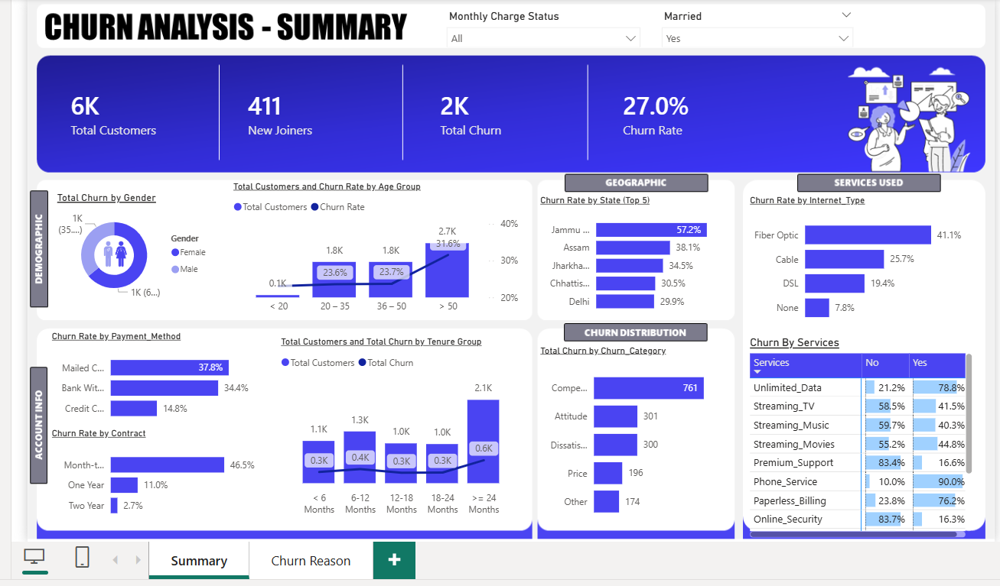

# 📊 Telecom Customer Churn Analysis


> An end-to-end customer churn analysis project for a telecom company — covering SQL-based ETL, Power BI dashboards, and a churn prediction page.

---

## 🖼️ Dashboard Preview



---

## 📈 Key Numbers at a Glance

| Metric | Value |
|---|---|
| 👥 Total Customers | **6K** |
| 🆕 New Joiners | **411** |
| 📉 Total Churn | **2K** |
| 🚨 Churn Rate | **27.0%** |

---

## 🎯 Project Goals

- 📌 Visualize and analyze customer data across **Demographic**, **Geographic**, **Payment & Account**, and **Services** dimensions
- 🔍 Study churner profiles to identify areas for targeted **marketing campaigns**
- 🤖 Identify a method to **predict future churners**

---

## 🗂️ Repository Structure

```
📦 Telecom-Churn-Analysis/
│
├── 📁 data/
│   └── Customer_Data.csv              # Raw source data (6,418 records)
│
├── 📁 sql/
│   ├── 01_create_database.sql         # Create db_Churn database
│   ├── 02_data_exploration.sql        # Null checks & distinct value queries
│   └── 03_etl_and_views.sql           # Clean data load + Power BI views
│
├── 📁 powerbi/
│   ├── churn_analysis.pbix            # Power BI dashboard file
│   └── power_query_and_measures.md   # All Power Query steps & DAX measures
│
├── 📁 assets/
│   ├── backgrounds/                   # Dashboard background images
│   └── icons/                         # Icons used in the report
│
├── .gitignore
└── README.md
```

---

## 🛠️ Tech Stack

| Tool | Purpose |
|---|---|
| **Microsoft SQL Server** | ETL, data cleaning, staging & production tables |
| **SSMS** | SQL query interface |
| **Power BI Desktop** | Dashboard & visualizations |
| **Power Query (M)** | Data transformation inside Power BI |
| **DAX** | Measures and KPI calculations |

---

## 🚀 How to Run This Project

### ✅ Step 1 — Set Up SQL Server

1. Install [SQL Server](https://www.microsoft.com/en-us/sql-server/sql-server-downloads) and [SSMS](https://learn.microsoft.com/en-us/sql/ssms/download-sql-server-management-studio-ssms)
2. Run `sql/01_create_database.sql` to create the `db_Churn` database
3. Import `data/Customer_Data.csv` as staging table `stg_Churn` via SSMS Import Wizard:
   - Right-click `db_Churn` → **Tasks → Import → Flat File** → Browse CSV
   - Set `Customer_ID` as **Primary Key**
   - Allow **NULLs** for all other columns
   - Change any `Bit` type columns to `Varchar(50)`
4. Run `sql/02_data_exploration.sql` to explore and validate the data
5. Run `sql/03_etl_and_views.sql` to clean data and create the `prod_Churn` table + views

### ✅ Step 2 — Open in Power BI

1. Open `powerbi/churn_analysis.pbix` in **Power BI Desktop**
2. Update the data source to point to your SQL Server instance
3. Click **Refresh**


## 📊 Dashboard Pages

### 🔵 Summary Page

| Section | Visuals |
|---|---|
| **Top Cards** | Total Customers, New Joiners, Total Churn, Churn Rate % |
| **Demographics** | Churn rate by Gender & Age Group |
| **Account Info** | Churn rate by Payment Method, Contract type, Tenure Group |
| **Geographic** | Top 5 States by Churn Rate |
| **Churn Distribution** | Churn by Category with Reason tooltip |
| **Services** | Churn rate by Internet Type & individual services |

### 🔴 Churn Reason Page *(Tooltip)*
- Detailed breakdown of all churn reasons and their volume

---

## 🔑 Key Insights

> 1. 🚨 **27% overall churn rate** — 1 in 4 customers is leaving
> 2. 📄 **Month-to-Month contracts** are the biggest risk — 46.5% churn vs just 2.7% for Two Year contracts
> 3. 🌐 **Fiber Optic users churn the most** at 41.1% despite being a premium service
> 4. 🏆 **Competitor offers** are the #1 churn reason — 761 customers lost to competition
> 5. 🗺️ **Jammu & Kashmir** has an alarming 57.2% churn rate — needs immediate retention focus
> 6. 👴 **Customers aged 50+** churn the most at 31.6% — potential need for senior-friendly plans
> 7. 🔒 **Online Security & Premium Support** subscribers churn far less — strong upsell opportunity
> 8. ⏳ **Long-tenure customers (≥ 24 months)** have the highest absolute churn volume — loyalty programs needed

---

## 📁 Dataset Overview

**6,418 customer records** across 32 columns:

| Category | Key Columns |
|---|---|
| **Demographics** | Customer_ID, Gender, Age, Married, State |
| **Account Info** | Contract, Payment_Method, Paperless_Billing, Tenure_in_Months |
| **Services** | Phone_Service, Internet_Type, Streaming_TV, Online_Security, etc. |
| **Financials** | Monthly_Charge, Total_Charges, Total_Revenue, Total_Refunds |
| **Churn Info** | Customer_Status, Churn_Category, Churn_Reason |

---


## 👤 Author

**Akash Thakur**  
[](https://github.com/akash-thakur05)

---

> ⭐ If you found this project useful, consider giving it a star!
